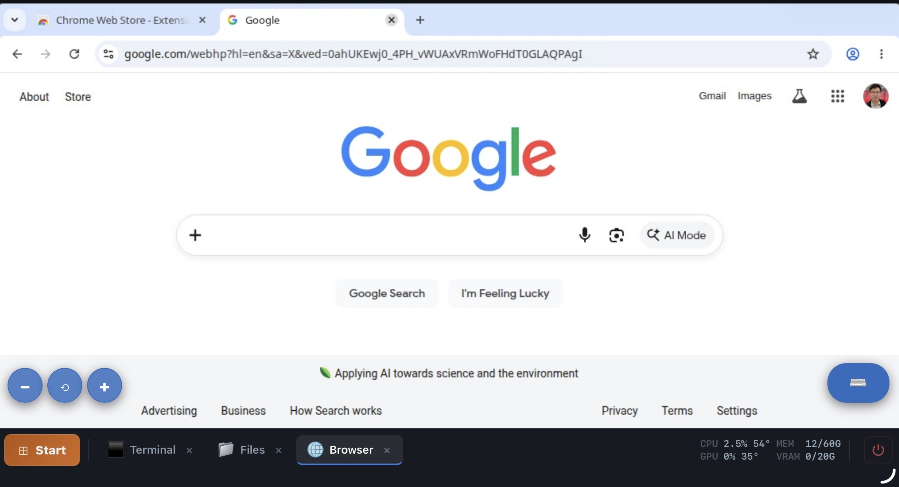
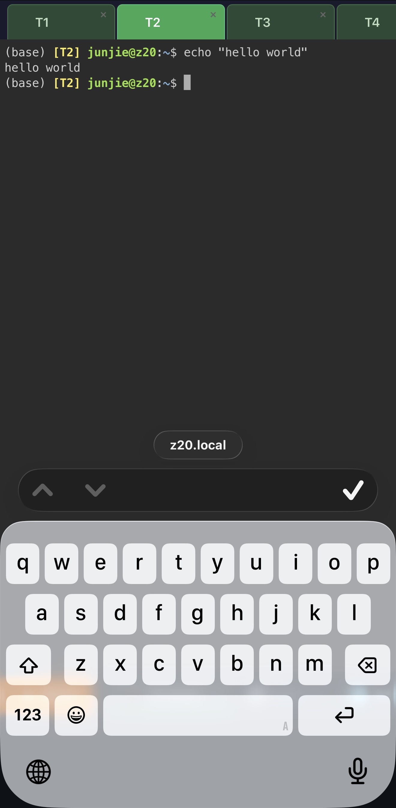

# service-in-browser

A unified "mini-OS" desktop experience served in the browser, exposed publicly
over HTTPS via Cloudflare Tunnel with Access auth. The root page is a desktop-like
UI with five tabs: **Home, Terminal, Browser, Files, and Notes**.

## Sub-projects

| Sub-project | URL path | What |
|---|---|---|
| `terminal` | `/t1/`..`/t50/`, `/terminals/`, `/api/` | Dynamic persistent bash terminals (ttyd + claude-session) + manager API |
| `browser`  | `/browser/` | Persistent Chromium viewable via xpra HTML5 client |
| `landing`  | `/` | Unified desktop UI with tab bar, iframe viewport, and status bar |
| `files`    | `/files/` | FileBrowser file manager rooted at `~` |
| `tunnel`   | — | Cloudflare Tunnel + Access config for public HTTPS |

## Deploy

Each sub-project has an idempotent `install.sh`. Order matters on first deploy:

```bash
sudo ./terminal/install.sh   # nginx skeleton + manager API
sudo ./browser/install.sh    # nginx snippet for the browser
./landing/install.sh         # desktop UI + file manager (no sudo)
sudo ./tunnel/install.sh     # cloudflared binary (tunnel setup is interactive)
```

All scripts support `--dry-run` and are configurable via env vars (see script headers).

See [`CLAUDE.md`](CLAUDE.md) for full architecture, health checks, and operational
commands, and [`docs/`](docs/) for deep dives.

## Screenshots

| Desktop — Files | Desktop — Browser |
|---|---|
|  |  |

| Mobile — Start menu | Mobile — Terminal + keyboard |
|---|---|
|  |  |
